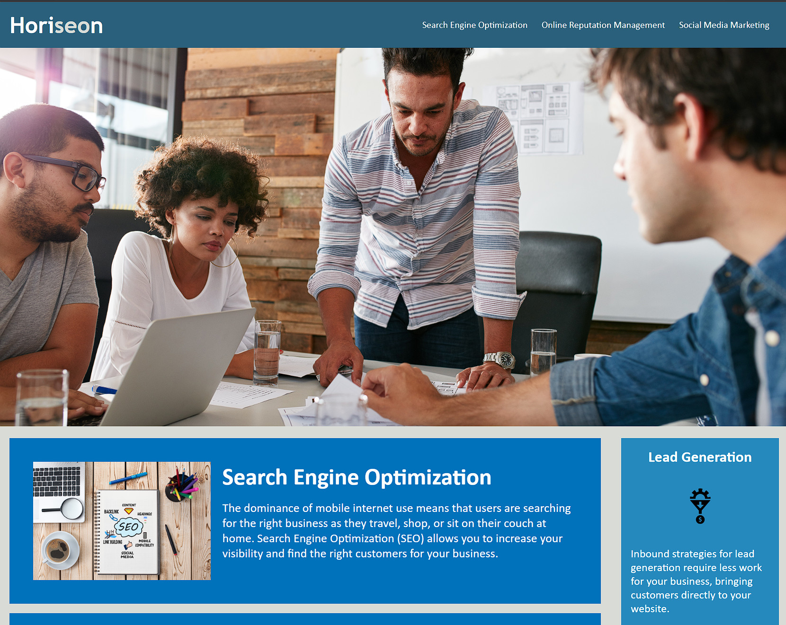
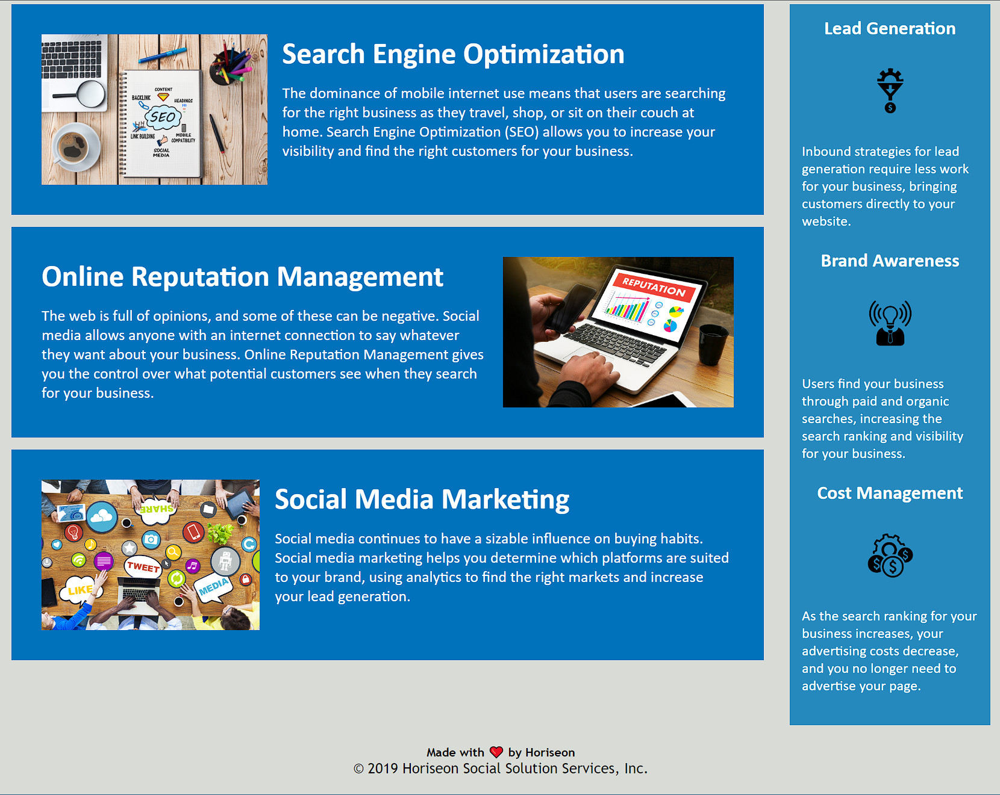

## Refactoring of the Horiseon webpage for accessibility

The Horiseon webpage needed a refactoring of the code to increase accessibility and fix a few minor errors. 
The code has been edited with 'alt' tags for images, semantic tags, labeled with comments,  and slightly rearranged to make reading the code easier.
 
 

## A snapshot of the site
 

 
 

# [Horiseon Website](https://swvmpdad.github.io/horiseon-refactor/)